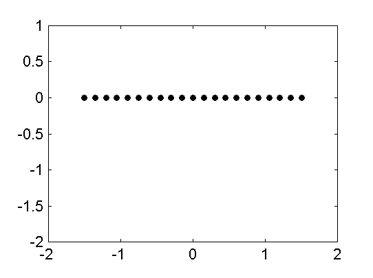
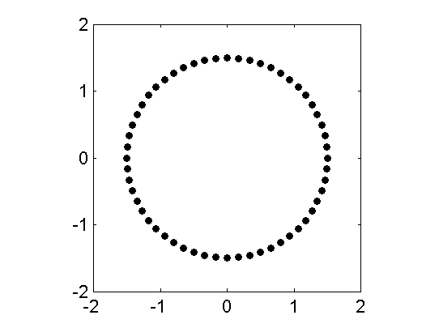
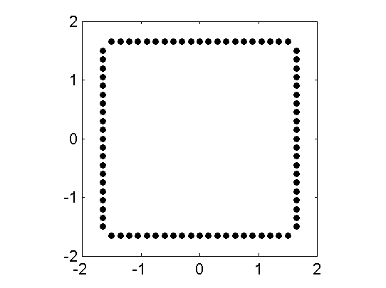
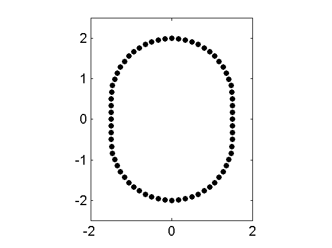
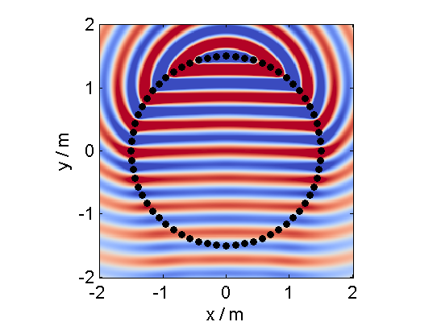
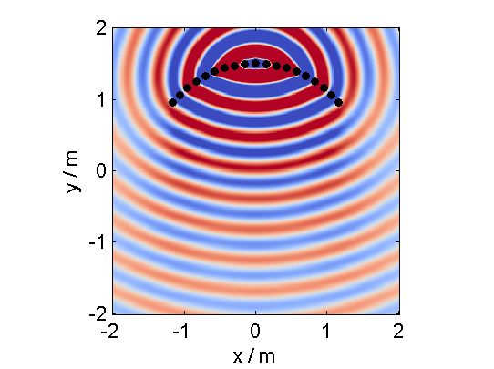
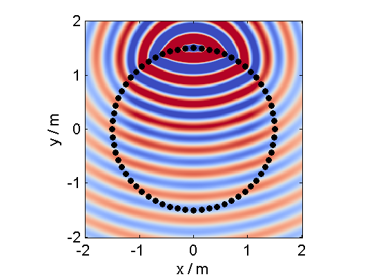
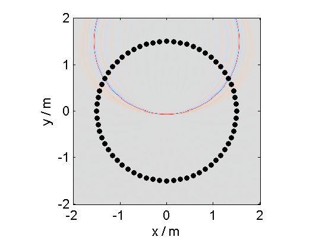
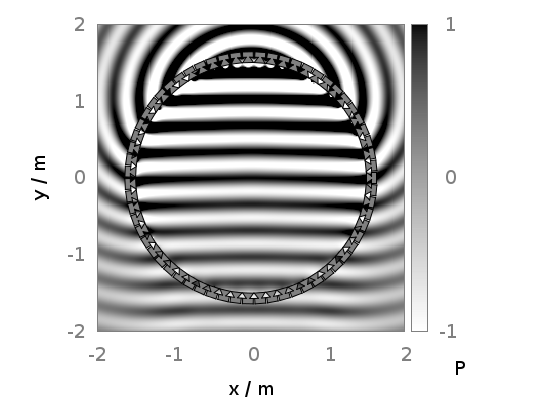

Sound Field Synthesis Toolbox
=============================

The Sound Field Synthesis Toolbox (SFS) for Matlab/Octave gives you the
possibility to play around with sound field synthesis methods like Wave Field
Synthesis (WFS) or near-field compensated Higher Order Ambisonics (NFCHOA).
There are functions to simulate monochromatic wave fields for different secondary
source (loudspeaker) setups, time snapshots of full band impulses emitted by the
secondary source distributions, or even generate Binaural Room Scanning (BRS)
stimuli sets in order to simulate WFS with the SoundScape Renderer (SSR).


Installation
------------

Download the Toolbox and add the main path of the Toolbox to your Matlab/Octave
path. After that copy <code>SFS_config_example.m</code> to
<code>SFS_config.m</code> and change it to your needs. For an easy beginning you
can just use the default settings by leaving everything as it is.
Then start the Toolbox with <code>SFS_start</code> which will add all needed
subpathes.


Requirements
------------

**Matlab**  
You need Matlab version 2011b or newer to run the Toolbox.
On older version the Toolbox should also work, but you need to add
[narginchk.m](http://gist.github.com/hagenw/5642886) to the
<code>SFS_helper</code>
directory.

**Octave**  
You need Octave version 3.6 or newer to run the Toolbox. In addition, 
you will need the following additional packages from 
[octave-forge](http://octave.sourceforge.net/):
* audio (e.g. for wavwrite)
* signal (e.g. for firls)

Now you set up the Toolbox and can made on of the following things with it:

Usage
-----

### Secondary Sources

The Toolbox comes with a function which can generate different common shapes of loudspeaker arrays for you.
At the moment these include linear, circular and box shaped arrays.

Before showing the different geometries, we start with some common settings. First we get a configuration struct
and set the array size/diameter to 3m.

```Matlab
conf = SFS_config;
L = 3;
```

#### linear array

```Matlab
conf.array = 'linear';
x0 = secondary_source_positions(L,conf);
figure;
figsize(conf.plot.size(1),conf.plot.size(2),conf.plot.size_unit);
draw_loudspeakers(x0);
axis([-2 2 -2 1]);
print_png('img/secondary_sources_linear.png');
```



#### circular array

```Matlab
conf.array = 'circle'; % or 'circular'
x0 = secondary_source_positions(L,conf);
figure;
figsize(conf.plot.size(1),conf.plot.size(2),conf.plot.size_unit);
draw_loudspeakers(x0);
axis([-2 2 -2 2]);
print_png('img/secondary_sources_circle.png');
```



#### box shaped array

```Matlab
conf.array = 'box';
x0 = secondary_source_positions(L,conf);
figure;
figsize(conf.plot.size(1),conf.plot.size(2),conf.plot.size_unit);
draw_loudspeakers(x0);
axis([-2 2 -2 2]);
print_png('img/secondary_sources_box.png');
```



#### arbitrary shaped arrays

You can also create arbitrary shaped arrays by settings the values of the single
loudspeaker directly in the <code>conf.x0</code> matrix, which has to be empty
if you want to use one of the above predefined shapes. The rows of the matrix
contain the single loudspeakers and the six columns are [x y z nx ny nz], the
position and direction of the single loudspeakers.

```Matlab
% create a stadium like shape by combining two half circles with two linear
% arrays
% first getting a full circle with 56 loudspeakers
conf.dx0 = L*pi/56;
conf.array = 'circle';
x0 = secondary_source_positions(L,conf);
% store the first half cricle and move it up
x01 = x0(2:28,:);
x01(:,2) = x01(:,2) + ones(size(x01,1),1)*0.5;
% store the second half circle and move it down
x03 = x0(30:56,:);
x03(:,2) = x03(:,2) - ones(size(x03,1),1)*0.5;
% create a linear array
conf.array = 'linear';
x0 = secondary_source_positions(1+conf.dx0,conf);
% rotate it and move it left
R = rotation_matrix(pi/2);
x02 = [(R*x0(:,1:2)')' x0(:,3) (R*x0(:,4:5)')' x0(:,6)];
x02(:,1) = x02(:,1) - ones(size(x0,1),1)*1.5;
% rotate it the other way around and move it right
R = rotation_matrix(-pi/2);
x04 = [(R*x0(:,1:2)')' x0(:,3) (R*x0(:,4:5)')' x0(:,6)];
x04(:,1) = x04(:,1) + ones(size(x0,1),1)*1.5;
% combine everything
conf.x0 = [x01; x02; x03; x04];
% if we gave the conf.x0 to the secondary_source_positions function it will
% simply return the defined x0 matrix
x0 = secondary_source_positions(L,conf);
figure;
figsize(conf.plot.size(1),conf.plot.size(2),conf.plot.size_unit);
draw_loudspeakers(x0);
axis([-2 2 -2.5 2.5]);
print_png('img/secondary_sources_arbitrary.png');
```




### Simulate monochromatic sound fields

With the files in <code>SFS_monochromatic</code> you can simulate a
monochromatic sound field in a specified area for different techniques like WFS
and NFCHOA.

For all 2.5D functions the configuration <code>conf.xref</code> is important as
it defines the point for which the amplitude is corrected in the wave field.
The default entry is
```Matlab
conf.xref = [0 0 0];
```

#### Near-field compensated higher order Ambisonics

The following will simulate the field of a virtual plane wave with a frequency
of 1kHz traveling into the direction (0 -1), synthesized with 2.5D NFCHOA.

```Matlab
conf = SFS_config;
conf.useplot = 1;
% wave_field_mono_nfchoa_25d(X,Y,xs,src,f,L,conf);
wave_field_mono_nfchoa_25d([-2 2],[-2 2],[0 -1],'pw',1000,3,conf);
print_png('img/wave_field_nfchoa_25d.png');
```



#### Wave Field Synthesis

The following will simulate the field of a virtual point source with a frequency
of 1kHz placed at (0 2.5)m synthesized with 2.5D WFS.

```Matlab
conf = SFS_config;
conf.useplot = 1;
% [x,y,P,x0,win] = wave_field_mono_wfs_25d(X,Y,xs,src,f,L,conf);
[x,y,P,~,win] = wave_field_mono_wfs_25d([-2 2],[-2 2],[0 2.5],'ps',1000,3,conf);
print_png('img/wave_field_wfs_25d.png');
```



You can see that the Toolbox is plotting only the active loudspeakers for WFS.
If you want to plot the whole array, you can do this by adding these commands.

```Matlab
x0 = secondary_source_positions(L,conf);
[~,idx] = secondary_source_selection(x0,[0 2.5],'ps');
win2 = zeros(1,size(x0,1));
win2(idx) = win;
plot_wavefield(x,y,P,x0,win2,conf);
print_png('img/wave_field_wfs_25d_with_all_sources.png');
```




### Simulate time snapshots of sound fields

With the files in <code>SFS_time_domain</code> you can simulate snapshots in
time of an impulse sending out from your WFS or NFCHOA system.

The following will create a snapshot in time after 200 samples for a broadband 
virtual point source placed at (0 2)m for 2.5D NFCHOA.

```Matlab
conf = SFS_config;
conf.useplot = 1;
% wave_field_imp_nfchoa_25d(X,Y,xs,src,t,L,conf)
wave_field_imp_nfchoa_25d([-2 2],[-2 2],[0 2],'ps',200,3,conf);
print_png('img/wave_field_imp_nfchoa_25d.png');
```




### Make binaural simulations of your systems

If you have a set of head-related transfer functions (HRTFs) you can simulate
the ear signals reaching a listener sitting at a given point in the listening
area for a specified WFS or NFCHOA system.
You can even download a set of HRTFs, which will just work with the Toolbox at 
http://dev.qu.tu-berlin.de/projects/measurements/wiki/2010-11-kemar-anechoic

In order to easily use different HRIR sets the toolbox incorporates its own
[struct based file
format](http://dev.qu.tu-berlin.de/projects/measurements/wiki/IRs_file_format)
for HRIRs and BRIRs. The toolbox provides conversion functions for three other
free available data sets (CIPIC,MIT,Oldenburg). In the future it will
incoorperate the newly advancing [SOFA HRTF file
format](http://sourceforge.net/projects/sofacoustics).

The files dealing with the binaural simulations are in the folder
<code>SFS_binaural_synthesis</code>. Files dealing with HRTFs are in the folder
<code>SFS_ir</code>. If you want to extrapolate your HRTFs to plane waves you
may also want to have a look in <code>SFS_HRTF_extrapolation</code>.

For example the following code will load our HRTF data set for a distance of 3m, then
a single impulse response for an angle of 30° is chosen from the set. If the
desired angle of 30° is not available, a linear interpolation between the next
two angles would be applied. Afterwards a noise signal is created and convolved
with the impulse response by the <code>auralize_ir()</code> function.

```Matlab
irs = read_irs('QU_KEMAR_anechoic_3m.mat');
ir = get_ir(irs,rad(30));
nsig = randn(44100,1);
sig = auralize_ir(ir,nsig);
```

To simulate the same source as a virtual point source synthesized by WFS and a
circular array with a diameter of 3m, you have to do the following.

```Matlab
irs = read_irs('QU_KEMAR_anechoic_3m.mat');
% ir = ir_wfs_25d(X,phi,xs,src,L,irs,conf);
ir = ir_wfs_25d([0 0],pi/2,[0 3],'ps',3,irs);
nsig = randn(44100,1);
sig = auralize_ir(ir,nsig);
```


#### Using the SoundScape Renderer with the SFS Toolbox

In addition to binaural synthesis, you may want to apply dynamic binaural
synthesis, which means you track the position of the head of the listener and
switches the used impulse responses regarding the head position. The [SoundScape
Renderer](http://spatialaudio.net/ssr/) is able to do this. The SFS Toolbox
provides functions to generate the needed wav files containing the impulse
responses used by the SoundScape Renderer.

```Matlab
brs = brs_wfs_25d(X,phi,xs,src,L,irs,conf);
wavwrite(brs,fs,16,'brs_set_for_SSR.wav');
```


### Small helper functions

The Toolbox provides you also with a set of useful small functions that may want
to use. Here the highlights are angle conversion with <code>rad()</code> and
<code>degree()</code>, FFT calculation and plotting <code>easyfft()</code>,
create noise signal <code>noise()</code>, rotation matrix
<code>rotation_matrix()</code>, even or odd checking <code>iseven()</code>
<code>isodd()</code>, spherical bessel functions <code>sphbesselh()</code>
<code>sphbesselj</code> <code>sphbessely</code>.


### Plotting with Matlab or gnuplot

The Toolbox provides you with a variety of functions for plotting your simulated
sound fields <code>plot_wavefield()</code> and adding loudspeaker symbols to the
figure <code>draw_loudspeakers</code>. If you have gnuplot installed, you can
even use it with the Toolbox by setting <code>conf.plot.usegnuplot =
true;</code>.

The following code reproduces the monochromatic wave field for NFCHOA from
above, but this time using gnuplot for plotting. The only difference is, that
you cannot do the plotting to png afterwards like in Matlab, but have to specify
the output file before. Note, that the same will work with Matlab.

```Matlab
conf = SFS_config;
conf.useplot = 1;
conf.plot.usegnuplot = 1;
conf.plot.file = 'img/wave_field_nfchoa_25d_gnuplot.png';
wave_field_mono_nfchoa_25d([-2 2],[-2 2],[0 -1],'pw',1000,3,conf);
```




Credits and License
-------------------

This is the source distribution of Sound Field Synthesis Toolbox (SFS) licensed
under the GPLv3+. Please consult the file COPYING for more information about
this license.
 
For questions, bug reports and feature requests:  
Contact: sfstoolbox@googlemail.com  
Website: http://github.com/sfstoolbox/sfs


Copyright (c) 2010-2013  
Quality & Usability Lab, together with  
Assessment of IP-based Applications  
Telekom Innovation Laboratories, TU Berlin  
Ernst-Reuter-Platz 7, 10587 Berlin, Germany 


Copyright (c) 2013  
Institut fuer Nachrichtentechnik  
Universitaet Rostock  
Richard-Wagner-Strasse 31, 18119 Rostock
